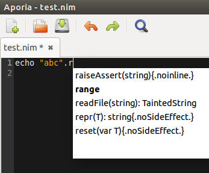
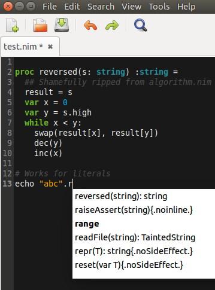

# Nim and OO
**原文链接：[http://goran.krampe.se/2014/10/29/nim-and-oo/]()**

**作者：Goran Krampe**

**Roads less Taken**

**A blend of programming, boats and life.**

**时间：2014,10,29**

nim作为一种命令语言呈现。是的，它有一些根源在pascal语言中，但是它有一套强大的抽象机制使它非常适合面向对象编程。当我写“object oriented(面向对象)”的时候，我指的是一个具有更广阔灵活度的OO，它可以通过附加行为规划对象，不同对象之间存在多态性，某种代码重用模型（继承等）和某种类型的动态调度。


既然我是一个接触smalltalker较长时间的人，所以我提到的主要是“good OO(好对象)”并不是。。。经常在Java或者c++中见到的丑陋的对象。很难解释它们之间的不同，但是我只说在smalltalk中的面向对象是优雅的和自然的，与ruby或者Python中的面向对象非常类似,但是它甚至更精简。smalltalk是一个动态的强类型反射语言并带有一个大量基于闭包的类型。

在这篇文章中我将尽力做到怎样在nim中使用面向对象更有意义。

## Smalltalk中的面向对象

在Smalltalk中我们大致有以下关于面向对象的机制，前4条与java中的面向对象相同。

1 单一继承的类模型

2 正常的"单一接收器"动态调用

3 能够使用super和self调用

4 垃圾收集

另外，Smalltalk增加了在java中明确没有的重要内容：

5 一切皆对象，对象包含所有的数据类型，所以我们可以继承它们，也可以扩展或重写方法

6 每一个行为都是一个信息调用一个方法，包含所有的操作符。唯一的例外是赋值和返回。

7 动态duck typing(鸭子类型)。

8 随着非局部回归能够表达的协议支持闭包普遍使用

当然若带有以下特点，smalltalk会是更完美的面向对象：

9 类也是对象，所以它们有方法和继承以及一个类。。。

10 类变量和类的实例变量

11 全元级意味着你的代码可以在运行时100%修改。
当然，这有更多的关于smalltalk-但是我认为，以上扑捉的大部分是其他开发商可能会叫做语言的面向对象机制。当然在类库和工具中会存在更多，如：优良的集合类。

做合理的OO不需要十全十美的东西,不过它是使smalltalk本身成为一种完全反射的IDE。第5-9条对于合理的面向对象不是必不可少的，但是它们使Smalltalk超越其他语言如Java，所以在那个层面，有趣的是看到nim在相同的空间所提供的东西。

所以理论上我想要看到nim至少支持1到4，希望通过其他机制支持5-8，能实现以上,nim将是一种完全不同的有独特性质的语言。

## How does Nim stack up?

学习nim确实很有趣，它就像"一盒巧克力"，带有很多丝滑灵活的机制需要学习。这也使它有些令人迷惑-什么材料我应该经常用到？我该避免什么？哪些部分相结合能在nim中产生对象？这不清楚。。。

而且，走过也并不完全清楚，但是它的一系列实验和结语涉及到上面Smalltalk的清单。我可以调整这篇文章吗？可能，我是否用了很多的样例代码？可能。这篇文章太长了吗？毫无疑问

但是，这里我们来过...

## 过程

我们可以从nim中的驿马(work horse)开始-procs。一个过程不过是一个规则的静态类型函数。这意味着我们可以在编译时静态绑定过程-并且过程支持参数重载，所以我们可以定义很多对于不同参数类型有不同实现的过程。

同时，nim介绍了所谓的UFCS在D编程语言建立缩写之前，所以,依照句法这些调用是等价的：

```nim
fn(a, b)
a.fn(b)
```

具有过程重载和统一函数调用语法结合整齐的模块系统，一个模块可以使用来自其他模块的类型定义过程（很明显你可以做到它）-然后我们已经可以以一种更简单的方式实现“OO looking code”。例如，我们可以很容易的为字符串类型添加一个reversed()方法，它返回一个新的反序字符串。

首先，让我们验证字符串开始没有reversed()方法。我使用Aporia并且我已经在参数选择中打开了“启用建议特征”，然后它试图帮助我：



...所以现在什么都没有。让我们破解。在下面的开始我们看到reversed()已经存在于在开放数组中了，开放数组意味着数组和序列类型。下面让我们为字符串添加reversed()方法：

```nim
#some data to play with
var anArray=[1,2,3,4]
var aSequence= @["a","b","c"]
var anArray2=[1,2,3]
var aSequence2= @["a","b","c","d"]

#Aha,in module algorithm.nim we already have reversed() for openarray which is type covering both array and seq.

#Hehe,we can import down here too if we like
import algorithm

#And yes,reversed works for those guys
echo(anArray.reversed())
echo(aSequence.reversed())
echo(repr(anArray))
#reverse()这样用,reverse()没有返回值，所以不能直接用echo()输出，这里我们先使用reverse(),再使用reversed()观察结果
reverse(anArray2)
reverse(aSequence2)
#echo(repr(anArray2))
echo(anArray2.reversed())
#echo(repr(aSequence2))

#But it doesn't work for string,let's add it        
proc reversed(s:string):string=
  #Shamefully ripped from algorithm.nim for openarrays
  result=s
  var x=0
  var y=s.high
  while x<y:
    swap(result[x],result[y])
    dec(y)
    inc(x)

#Testing it,works for literals
echo "abc".reversed

#Works for vars too of course
var test="Goran"
echo(test)
echo(test.reversed)

#And yes,not destructive."reverse"(no d)would be destructive
#algorithm模块中的reversed()没有破坏性，reverse（）将是具有破坏性的
echo(test)
```

...使用Aporia，实际上在我们写了字符串的reversed过程后我们可以立即看到它，编译器捕获它并提供它作为一个建议，当我们开始编写test代码的时候：



**Compile and run:**

```nim
gokr@yoda:~$ nim c -r --verbosity:0 testreversed.nim
@[4, 3, 2, 1]
@[c, b, a]
cba
Goran
naroG
Goran
gokr@yoda:~$
```

有趣的旁注：“Göran”没有很好的工作...UTF8罢工!但是这是非常自然的给我们non-UTF8（非UTF-8） 意识的实现，我们以反转两个字节的UTF8代表“ö”而结束...

**Remark**

在每个备注头我尝试链接到Smalltalk和那个细目清单。多数Smalltalk实现有“类扩展”机制(能够在你包外的类中添加方法)，它们在nim中相当容易，甚至是内置数据类型，因为所有的过程(方法，继续阅读)都是分开定义的以及在类型上操作，不仅仅是对象。我们有UFCS语法糖，造成完成时的假象。

在nim中很多操作者都以同样的方式处理，所以在其他语言中我们可以实现的事情是“硬链接“，如==（相等）使用相同的机制。这是与Smalltalk很好的混合。

我想说的是上面列出的第5和第6条在nim中有很好的支持。
**Distinct类型**
在nim中关于基本数据类型一个额外的抽象是我们可以对它们做类型别名和不同类型。一个别名是一样的，相同的。但是一个不同类型创建一个完全独立的类型-它仅仅偶尔才会成为相同的事情。这使得内置数据类型具有更大的可塑性，也能够使我们的代码是类型安全的和严格的。

**Play time, just messing a bit:**

```nim
# We create a FreakInt which behaves like an int, but is its own type.
# We can not pass a FreakInt when someone wants an int - and vice versa.
# This also means that all operators and procs defined for ints, do NOT
# apply for a FreakInt - they are dumb as hell basically.
type
  FreakInt = distinct int

# Ok, so we borrow multiplication by an int
proc `*` (x: FreakInt, y: int): FreakInt {.borrow.}

# Let's override `+`: FreakInt also multiplies by 2...
proc `+` (x, y: FreakInt): FreakInt =
  FreakInt((int(x) + int(y)) * 2)

# Can we go down the rabbit hole? What happens with a distinct
# type of a distinct type?
type
  UltraFreak = distinct FreakInt

# Ok, so we borrow `*` and `+` from FreakInt?
# No, it turns out it borrows from the base type int - this is NOT inheritance.
proc `+` (x, y: UltraFreak): UltraFreak {.borrow.}
proc `*` (x: UltraFreak, y: int): UltraFreak {.borrow.}

# UltraFreak ints multiply by 10 when doing subtraction...
proc `-` (x, y: UltraFreak): UltraFreak =
  UltraFreak((int(x) - int(y)) * 10)

# Hold onto hat..
var
  i: int = 5
  f: FreakInt = 6.FreakInt # Conversion, same as FreakInt(6)
  u: UltraFreak = 7.UltraFreak

# Did FreakInt manage to borrow `*` from int? yes 
assert(int(f * i) == 30)

# Did FreakInt manage to override `+`? yes
assert(int(f + f) == 24)

# Did UltraFreak manage to borrow `+` from... what?
# Ok, from int, not FreakInt!
assert(int(u + u) == 14)

# Also from int, not FreakInt!
assert(int(u * i) == 35)

# But we did get our own `-`, right? Yes we did.
assert(int(u - 3.UltraFreak) == 40)
```

**Remark**

在我看来，在nim中的不同类型捕获的远远超过第5和第6条-虽然我们不能从基本数据类型继承，事实上我们可以：

1 可以从基本数据类型创造不同的类型然后扩展它们

2 实际上甚至借基本类型是实现一个程序的过程或者一个运算的运算的基础。但是仅仅来自基本类型。我猜想这同样能在其他基本类型上实现不仅是内置类型。

这里有相当多的其他机制在这里我没有提及，例如重写“.”-访问或者解引用操作符"[]"等等。我会说所有的这些足够了为了能够在“一个面向对象方式“中使用基本数据类型就像在Smalltalk中我们能做的。

**元组**

好的，让我们转到更复杂的数据。一个元组就像是C中的一个struct(结构体)或是数据库表中的一个记录或一行。它由名字和类型域以特定的顺序组成：

```nim
Person: tuple[name: string, age: int]
```

所以它是nim中最简单的数据异构形式，它们没有开销以及它们在运行时不知道自己的类型（所以在元组上的动态调度是不可能的），并且它也没有隐藏的成员。

因此一个元组是一个很基本的类型，跟它们的大哥对象相比给出了限制，它们应该用在使用方便或者零开销的问题上而不是信息隐藏或者更复杂的链接行为。

在nim的标准库中，我们发现元组就像是集合类型中的一个小积木，比如KeyValuePair,一个复数，一个点或者一个矩形中的圆形，或者一个名字和版本的组合等。小巧并且简单的东西，事实上当涉及到集合它们具有零存储开销当然是重要的。但是它们不经常使用，甚至和对象一样多，一些快速搜索像grep -r"=tuple"在lib显示25hits.对象使用的通常是10倍以上，并且在这一段的第一句话我可能已经列出元组在使用时的一半可能性。

如果你不确定应该使用一个元组或者一个对象，我建议你最好使用一个对象。

**Remark**

元组看似是最有趣的在集合内部或类似的低级别的代码中。对于大部分面向对象代码，对象是更好的选择。

**引用和指针**


在我们走的更远之前我们需要看看nim中的引用和指针。nim可以说比java或者Smalltalk可以更接近元级工作。为了能够做到那样，nim需要规则的c类型的指针，它们被声明为指针类型。例如一个指针变量，它直接指向一个内存的位置，通常在链接c时或者你想在规则外稍微玩一下时使用，例如当你想在内存中分配一些东西，然后传给另一个线程-当释放的时候自己保持跟踪轨迹。

作为一种语言想要覆盖所有的基础，这是必不可少的原料，当然那是不安全的地区，感觉就像是用你众所周知的脚射门。但是对于定期的应用层代码我们可能根本不需要使用ptr。

相反，我们使用的引用它实际上也是一个指针，但是它相对友好，可以自动分配，特别是可以用垃圾收集器释放我们所用的内存单元。如果我们声明类型KeyValuePair = tuple[key: string, value: string]，没有使用ref，然后在一个过程中使用它声明一个变量x，然后当那个程序被调用的时候，变量x将会被分配到栈帧中，因此当程序返回的时候变量会消失。它是合乎逻辑的，变量x是一个元组，没有一个指针指向它。在这个例子中，没有任何东西分配在堆中并且不需要垃圾收集器，因为例子中所有的值都在栈中。

但是对于想让数据比当前的调用过程存活的时间更长，我们需要使用ref类型。对于这个类型值会在堆上分配，并且变量将拥有一个指向它的指针，并且垃圾回收器跟踪我们的引用。

一点测试代码显示，既然我们通常使用ref来引用对象，那么我们也可以引用其他类型像枚举：

```nim
# Playing with ref, enum and assignment

type
  LightImpl = enum LiGreen, LiYellow, LiRed
  Light = ref LightImpl

# Convenience method, good style
proc newLight(): Light = new(result)

var
  # This is a variable allocated in the stackframe
  light: LightImpl
  # This allocates and initializes a LightImpl on the heap
  # and makes lightHolder refer to it. If you do initialization
  # separately you can also use `new(lightHolder)`
  lightHolder = new(LightImpl)
  # Better style to call a proc to do it.
  lightHolder2 = newLight()

# Dereference to get the Light value, check it has the default value
assert(lightHolder[] == LiGreen)

# Set the local stackframe allocated Light to a different value
light = LiYellow

# Assignment copies the bits of light to the Light on the heap
# You need to use `[]` dereferencing here.
lightHolder[] = light

# Should be yellow now
assert(lightHolder[] == LiYellow)

# Let's modify the local stackframe light
light = LiRed

# Make sure the Light on the heap is still yellow 
assert(lightHolder[] == LiYellow)
```
